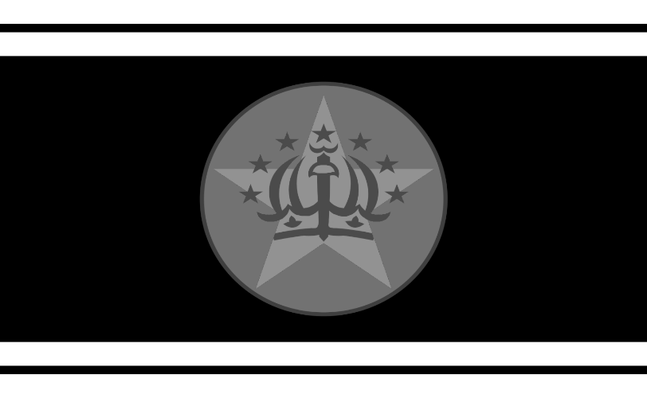

# The Heir

> "The Federation is soon to die, and we are next in line."

A separtist faction of the Federation solely believing that the Federation is incompetent and requires a change in leadership, unlike the [[Human Union](human_union)](human_union) (which they are enemies with), the Heir does not believe in genocide of other species but rather Federation replacement.

- **Allies:** [Botani Union](botani) Union, [Roach Conglomerate](roach_conglomerate), [Tauri Corporation](tauri)
- **Enemies:** [Human Union](human_union), The Heir, [Pirates](pirates), [Galactic Federation](federation)
