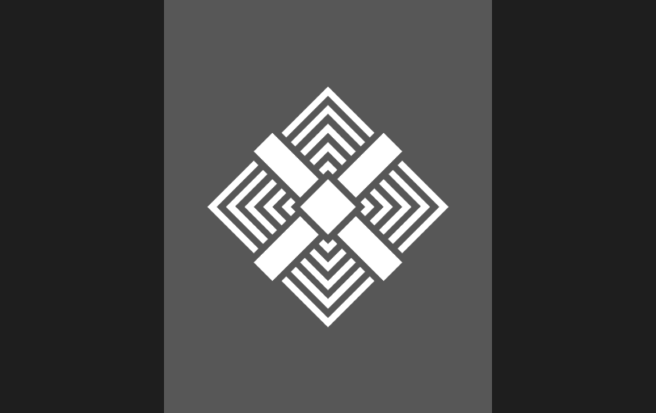

# Independent

> "Please leave us alone."

The **Independent** faction is not really one *unified* faction per se but rather a union of merchants, traders, workers and more. If it doesn't have a flag, then it's probably an Independent ship.

Attacking **Independent** ships are usually frowned upon in most sectors of space, as they are considered civilians.

## Diplomatic Chart

- **Allies:** None
- **Enemies:** [Pirates](pirates)
