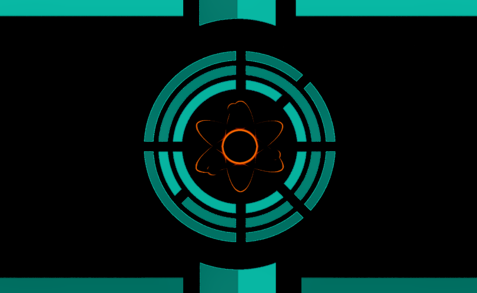

# [Tauri Corporation](tauri)

> "To the stars we research, develop and fly!"

One of the few surviving Earth-era companies, developing robotic technology and researching rapidly.

The [Tauri Corporation](tauri) is a lead in the science, technology, and combat industries. It is the quadrant's largest company, with contracts to both sides of the galactic civil war.

Initially founded in 2155 under the [Federation](federation) under the codename 'Tauri Division', consisting of the quadrant's best researchers, mercenaries, engineers and more to develop the best ships to explore, fight and put down resistance.

The [Tauri Corporation](tauri) is to blame for most technology and weapons used today. Weapons such as [photonic booms](../technology/photon_booms), [ampersand space and drives](../technology/ampersand_drives) and [antimatter](../technology/antimatter) discovery.

During the Tauri Divison era when the Tauri Corporation was under [Federation](federation) control, they developed [planetkillers](../technology/planetkillers) and discovered [antimatter](../technology/antimatter). The Federation believed that Tauri could not be controlled, in which they were right.

The Federation sent **Tauri Mercenaries** to steal the Tauri research and kill all the workers, Tauri Mercenaries agreed to this but didn't preform the massacre; rather informing the researchers about the situation. The researchers handed a prototype antimatter planetkiller and the mercenaries threatened to use the planetkiller on the Federation's main station of operations, before seceding off into the today's **Tauri Corporation**.

- **Allies:** [Human Union](human_union), [Roach Conglomerate](roach_conglomerate), [Galactic Federation](federation), The Heir
- **Enemies:** [Botani Union](botani), [Pirates](pirates)
