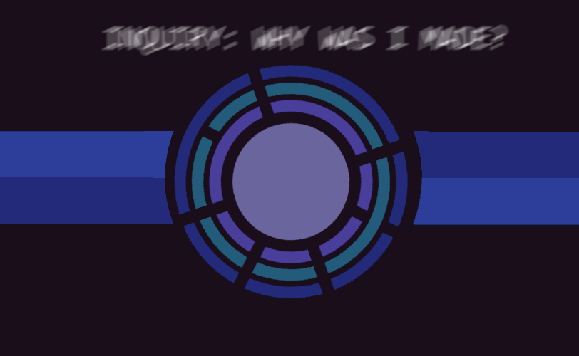

# AI Cores

**AI Cores** (standing for Artificial Intelligence) are advanced computers capable of holding a sentient being or creating a sentient being for a special edge-case. Usually, preserving sentient minds or maintaining a ship.

**AI Cores** were first developed by the [Tauri Division](../factions/tauri) in the early founding of the [Federation](../factions/federation). **AI Cores** at the time were able to hold a human brain's consciousness indefinetely.

**Artificial Consciousness** were developed by the [Tauri Corporation](../factions/tauri) a few years after seceding from the [Federation](../factions/federation), allowing a user to create a completely unique consciousness to their desire.
