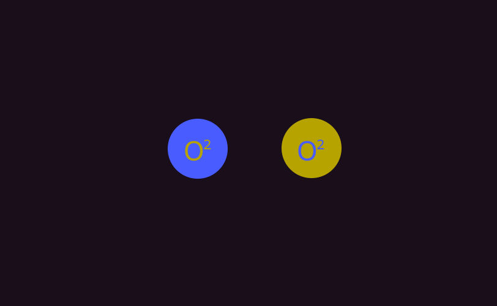

# Antimatter

**Antimatter** discovered by the early [Tauri Division](../factions/tauri) while they were still under [Federation](../factions/federation) control. Antimatter are subatomic particles that are inverted from their regular elemental states (notated by prefixing with a `-`, such as `-O2` for antimatter oxygen). Interaction with `-O2` and regular `O2` particles causes a subatomic tear in reality and a mass pressure expansion, useful for weaponry.
